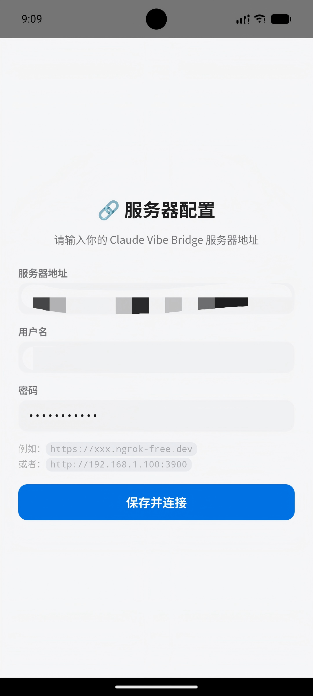
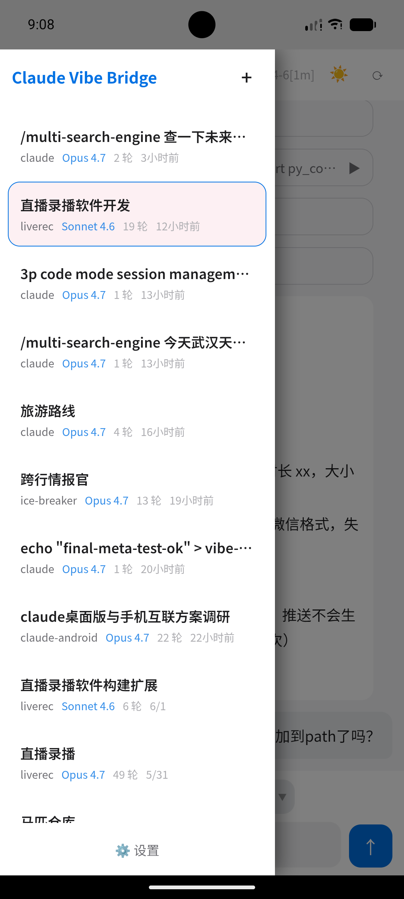
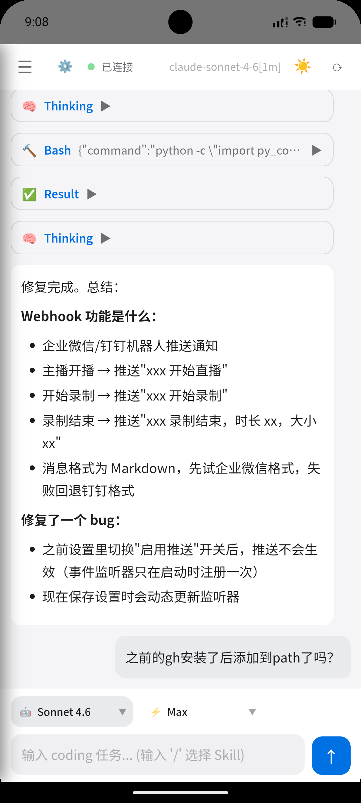

# Claude Vibe Bridge

[English](README_EN.md)

> 基于 **Claude Desktop 3P（第三方 API 模式）** 的 Web 界面。通过手机或浏览器远程操控 PC 上的 Claude Desktop 编程代理，支持实时流式响应和工具审批。

**Claude Desktop 3P 是什么？** Claude Desktop 有一个"第三方 API"模式，暴露 `claude.exe` CLI 并支持流式 JSON 输出。本项目将这个 CLI 包装成 Web 服务器 + PWA，让你用手机和 Claude 的编程代理对话，同时它在你的 PC 上工作。

## 架构

```
手机/浏览器 ──WebSocket──> 服务端 (Express) ──spawn──> claude.exe (Claude Desktop 3P)
   (PWA)        流式传输       (端口 3900)    stdin/out      (编程代理)
```

- **服务端** 使用 `--output-format stream-json` 启动 `claude.exe`，通过 WebSocket 中继消息
- **客户端** 是一个实时渲染对话的 PWA
- 会话存储在 Claude Desktop 自己的会话目录中 —— 不重复存储数据
- **不需要 API Key** —— 认证由 Claude Desktop 自身处理

## 界面预览

| 服务器配置 | 会话栏 | 对话界面 |
|:---:|:---:|:---:|
|  |  |  |

## 前提条件

- **Windows** 系统，已安装 [Claude Desktop](https://claude.ai/download)
- Claude Desktop 需要启用 **3P 模式**（设置 > 开发者 > 第三方 API）
- **Node.js 18+**

## 快速开始

```bash
# 1. 安装依赖
npm install

# 2. 配置（复制并编辑）
cp .env.example .env

# 3. 启动
npm run dev:server    # 服务端运行在 http://localhost:3900
```

在任意浏览器中打开 `http://localhost:3900` or `https://your-ip:3900`。服务端会自动发现你的 Claude Desktop 安装。

### 生产构建

```bash
cd client && npx vite build    # 构建到 client/dist
cd .. && npx tsx server/src/index.ts    # 服务端托管 client/dist
```

## 配置

所有配置都在 `.env` 文件中（参见 `.env.example`）：

| 变量 | 默认值 | 说明 |
|------|--------|------|
| `AUTH_ENABLED` | `false` | 启用 HTTP Basic Auth 认证 |
| `AUTH_USERNAME` | | 登录用户名 |
| `AUTH_PASSWORD` | | 登录密码 |
| `PORT` | `3900` | 服务端口 |
| `ALLOWED_DIRS` | `%USERPROFILE%` | 代理可访问的目录（用 `\|` 分隔多个） |
| `CLAUDE_DESKTOP_USER_ID` | 自动发现 | 多账户时手动指定 |
| `CLAUDE_DESKTOP_APP_ID` | 自动发现 | 多账户时手动指定 |

> Claude Desktop 路径（用户 ID、应用 ID、CLI 位置）**启动时自动发现**，通常不需要手动配置。

## 功能

- **实时流式传输** —— thinking blocks、文本、工具调用/结果实时到达
- **基于 Thread 的会话** —— 恢复已有的 Claude Desktop 对话
- **工具审批** —— 可选地要求浏览器审批文件写入和命令执行
- **模型和推理强度选择** —— 切换 Opus/Sonnet/Haiku 和推理强度
- **Markdown 渲染** —— 表格、代码块、标题、列表、链接
- **5 套主题** —— 深海、日光、赛博朋克、极简、森林
- **PWA** —— 可安装到手机，作为独立应用使用
- **认证** —— HTTP 和 WebSocket 均支持 HTTP Basic Auth
- **Skill 支持** —— 输入 `/skill-name` 注入 Claude Desktop Skills
- **Android 应用** —— Capacitor 封装的原生 Android（见 `android/`）

## Android 应用

项目包含基于 Capacitor 的 Android 应用：

```bash
cd client && npx vite build    # 构建 Web 资源
npx cap sync android           # 同步到 Android 项目
# 在 Android Studio 中打开 android/ 目录构建 APK
```

Android 应用会自动检测服务器地址。对于远程服务器，首次启动时会显示配置界面。

## 公网访问（ngrok / frp）

从外部网络访问，请参见 `frp/ngrok.md` 或 `frp/DEPLOY.md` 了解 ngrok、frp、natapp 的隧道设置。

## 项目结构

```
├── client/          # 原生 TypeScript PWA (Vite)
│   └── src/
│       ├── components/    # 状态栏、输入栏
│       ├── views/         # 聊天视图、会话列表
│       ├── state/         # 响应式状态管理
│       ├── services/      # WebSocket 客户端
│       └── styles/        # CSS 主题
├── server/          # Express + WebSocket 服务器
│   └── src/
│       ├── agent/         # CLI 运行器（启动 claude.exe）
│       ├── session/       # 会话持久化
│       └── ws/            # WebSocket 处理
├── shared/          # 协议和会话类型
├── android/         # Capacitor Android 项目
└── frp/             # 网络隧道指南
```

## License

MIT
